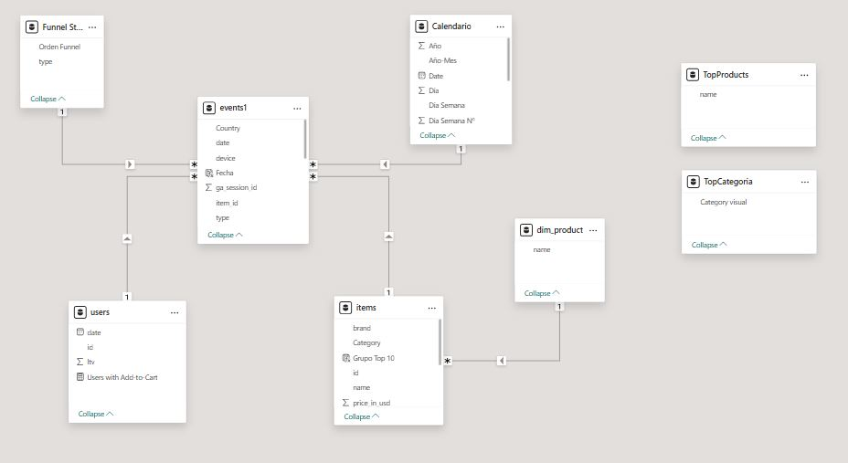
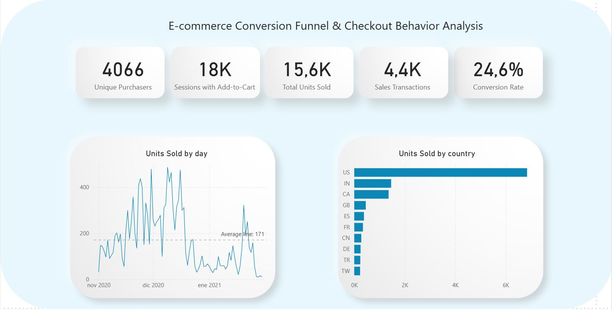
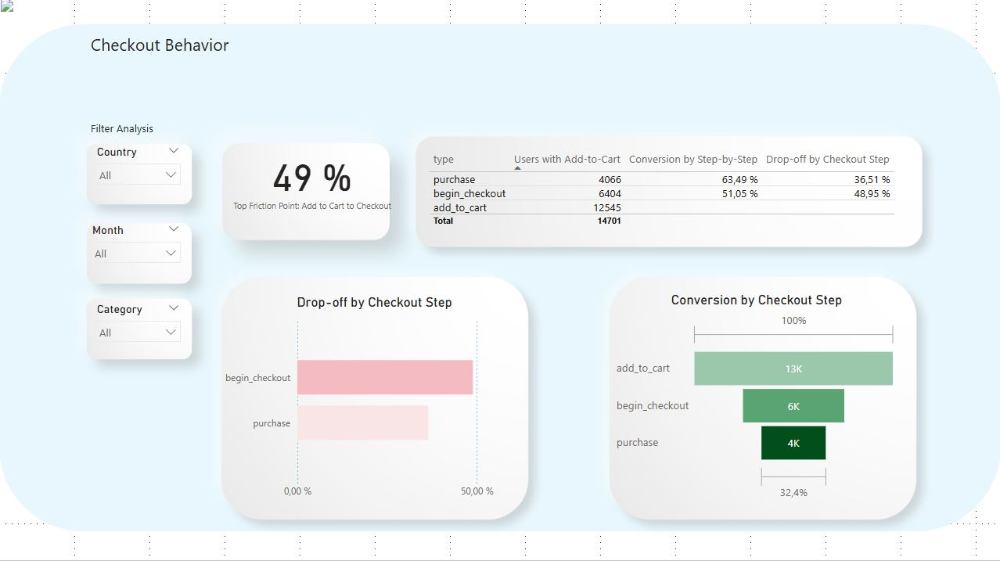

# Google Merchandise Store: E-commerce Conversion Funnel & Checkout Behavior Analysis

## 📌 Project Overview

This project analyzes the purchase journey and financial performance of the **Google Merchandise Store**. Using **Power BI**, raw e-commerce data was transformed into actionable business intelligence to identify where customers drop off in the checkout funnel and how revenue opportunities can be improved.

- **Data Source:** The analysis is based on the [Google Merchandise Sales Dataset](https://www.kaggle.com/datasets/mexwell/google-merchandise-sales-data) available on Kaggle.
- **Dataset Content:** The dataset contains granular records of e-commerce activities, including **user events** (add-to-cart, checkout, purchase), **product catalog data** with pricing in USD, and **geographic and device information**.
- **Key Focus:** Analysis of **12,545 "Add to Cart" events** to investigate the **49% friction point before checkout** and quantify its financial impact using custom **DAX measures**.

## 🚧 Project Status

This project is currently **in progress**.

The current version focuses on:
- Checkout funnel behavior
- User event analysis
- Initial data model development

The **financial impact analysis and revenue modeling using DAX measures** are currently being developed and will be added in the next update.
---

## 🛠️ Technologies Used

**Data Preparation**  

**Analysis & Visualization**  

**AI Assistance**  

---

## 🏗️ Data Model & Relationships

The project follows a structured **star-schema inspired data model** to ensure accurate calculations across the checkout funnel.

### Fact Table

**events1**  
Contains core e-commerce events such as:

- `add_to_cart`
- `begin_checkout`
- `purchase`

### Dimension Tables

**items**  
Connected via `item_id`, providing:

- product names  
- pricing in USD

**users**  
Connected via `user_id` to track **unique purchaser behavior**.

### Relationships

A **One-to-Many (*:1)** relationship was established between the events table and the product catalog.  
This structure enables **granular revenue analysis and accurate funnel calculations**.
items: Connected via item_id, providing product names and pricing in USD.

users: Connected via user_id to track unique purchaser behavior.

Relationships: Established a One-to-Many (*:1) relationship between the events and the item catalog, enabling granular revenue analysis.

---
## Dashboard Overview

## :mag_right: Insights

The dataset contains 4,066 unique purchasers and 4.4K transactions.
The overall conversion rate is 24.6% from add-to-cart to purchase.
Sales activity peaked in December 2020, suggesting strong holiday demand.

## :mag_right: Insights

The largest drop-off occurs between Add-to-Cart and Checkout (~49%).
Only 51% of users who add items to the cart proceed to checkout.
Once users reach checkout, 63% complete the purchase, indicating relatively strong checkout completion.
Only 32% of users who add items to the cart complete a purchase.

